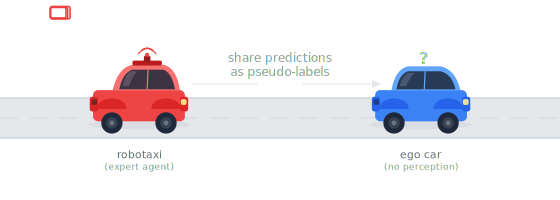

> **New work:** Check out [When the City Teaches the Car](https://jinsuyoo.info/civet/) — label-free 3D perception from infrastructure!

<div align="center">
<h1>Learning 3D Perception from Others' Predictions</h1>

<p><em>A label-efficient framework for 3D detection using expert predictions</em></p>

<a href="https://arxiv.org/abs/2410.02646"></a>
<a href="https://jinsuyoo.info/rnb-pop/"></a>
<a href="https://openreview.net/forum?id=Ylk98vWQuQ"></a>

<br>

**ICLR 2025** &nbsp;·&nbsp; **DriveX @ ICCV 2025 (Oral)**

<br>

[Jinsu Yoo](https://jinsuyoo.info/)<sup>1</sup>, [Zhenyang Feng](https://github.com/DeFisch)<sup>1</sup>, [Tai-Yu Pan](https://tydpan.github.io/)<sup>1</sup>, [Yihong Sun](https://yihongsun.github.io)<sup>2</sup>, [Cheng Perng Phoo](https://cpphoo.github.io)<sup>2</sup>, [Xiangyu Chen](https://cxy1997.github.io)<sup>2</sup>, [Mark Campbell](https://campbell.mae.cornell.edu/)<sup>2</sup>, [Kilian Q. Weinberger](https://www.cs.cornell.edu/~kilian/)<sup>2</sup>, [Bharath Hariharan](https://www.cs.cornell.edu/~bharathh/)<sup>2</sup>, [Wei-Lun Chao](https://sites.google.com/view/wei-lun-harry-chao/home)<sup>1</sup>

<sup>1</sup>The Ohio State University &nbsp;&nbsp; <sup>2</sup>Cornell University

<br>

---



</div>

---

## 🔍 Overview

Can an autonomous vehicle learn 3D perception by observing predictions from a nearby expert agent — without accessing its raw sensor data or model weights? **R&B-POP** answers yes, but shows that naively using expert predictions as pseudo-labels yields poor performance due to two fundamental challenges:

- **Mislocalization**: GPS inaccuracies and timing delays introduce positional error, causing pseudo-labels to be offset from the true object locations.
- **Viewpoint mismatch**: Objects visible to the expert may be occluded or outside the ego vehicle's field of view, resulting in false positives and missed detections.

R&B-POP addresses these challenges with a two-stage self-training pipeline on [V2V4Real](https://mobility-lab.seas.ucla.edu/v2v4real/), a real-world collaborative driving dataset. A lightweight PointNet-based **box ranker** — trained with fewer than 1% labeled frames (~40 frames total) — refines and filters the noisy pseudo-labels before training the ego detector. A **distance-based curriculum** further improves training by first focusing on nearby objects (where pseudo-labels are more reliable) before gradually expanding to longer ranges. The pipeline iterates: refined labels train a better detector, which in turn generates cleaner pseudo-labels for the next stage.

---

## 🛠️ Installation

### 1. Create conda environment

```bash
conda create -n rnb-pop python=3.8 -y
conda activate rnb-pop
```

### 2. Install PyTorch

Install PyTorch matching your CUDA version. The codebase was developed with CUDA 11.8:

```bash
pip install torch==2.0.1+cu118 torchvision==0.15.2+cu118 --index-url https://download.pytorch.org/whl/cu118
```

### 3. Install spconv

[spconv](https://github.com/traveller59/spconv) is required for the voxelization backbone. Install the version matching your CUDA:

```bash
pip install spconv-cu118
```

### 4. Install remaining dependencies

```bash
git clone https://github.com/jinsuyoo/rnb-pop.git
cd rnb-pop
pip install -r requirements.txt
```

### 5. Install the package (editable mode)

```bash
pip install -e .
```

This makes `opencood`, `ranker`, and `tools` importable from anywhere within the project.

### 6. Build CUDA/Cython extensions

> **Note:** On systems that default to Intel compilers (e.g., OSC), prepend `CC=gcc` to avoid linker errors with Intel-specific symbols.

```bash
# Cython extension for 2D box overlap computation
CC=gcc python opencood/utils/setup.py build_ext --inplace

# CUDA extension for 3D IoU / NMS
cd opencood/utils/iou3d_nms
CC=gcc python setup.py build_ext --inplace
cd ../../..
```

---

## 📦 Dataset: V2V4Real

R&B-POP is evaluated on [V2V4Real](https://mobility-lab.seas.ucla.edu/v2v4real/), a real-world collaborative driving dataset with a Tesla (ego car, `car_id=0`) and a Honda (reference car, `car_id=1`) driving within 100m of each other.

1. Download the dataset from the [V2V4Real website](https://mobility-lab.seas.ucla.edu/v2v4real/).
2. Set `data_path` in `configs/rnb_pop_v2v4real.yaml` to your dataset root.

---

## 🤖 Pretrained Models

| Model | File | Description |
|---|---|---|
| Ego Car Detector | `pretrained_models/ego_detector.pth` | R&B-POP trained detector |
| Box Ranker | `pretrained_models/ranker.pth` | Trained with 2 annotated frames per scenario (~40 frames total) |
| Reference Car Detector | `pretrained_models/refcar_detector.pth` | PointPillars (32-beam) trained on reference car LiDAR |

---

## 🚀 Usage

Set your dataset root once and reuse it throughout:

```bash
DATA_DIR=/path/to/v2v4real   # <-- set this to your V2V4Real dataset root
```

The pipeline consists of the following steps:

```
[Step 1] Generate ranker training data (skip if using pretrained)
    ↓
[Step 2] Train box ranker (skip if using pretrained)
    ↓
[Step 3] Run R&B-POP pipeline (2-stage self-training)
    ↓
[Step 4] Evaluate
```

### Initial Pseudo-Labels

We provide preprocessed initial pseudo-labels (reference car predictions projected into the ego frame, z-adjusted, FP-filtered) as `exp/refcar_predictions_preprocessed.tar.gz` (~1 MB), included in this repository. After cloning, simply extract:

```bash
tar -xzf exp/refcar_predictions_preprocessed.tar.gz -C exp/
```

The `initial_label_path` in the pipeline scripts is already set to `exp/refcar_predictions_preprocessed`.

The pretrained reference car detector checkpoint (`pretrained_models/refcar_detector.pth`) is also provided in case you want to regenerate the predictions yourself.

---

### Step 1: Generate Ranker Training Data (optional)

Skip this step if using the pretrained ranker (`pretrained_models/ranker.pth`).

#### Ground Plane Estimation

The box ranker uses per-frame above-ground point masks stored under `above_ground_ransac/` inside the dataset root. Since the ranker is trained on ego car data only, generate them for the ego car:

```bash
python data_preprocessing/generate_ground_plane.py \
    --root_dir $DATA_DIR \
    --train_split subset2 \
    --car_id 0
```

#### Generate training data

```bash
python ranker/generate_data/generate_ranker_data.py \
    --root_dir $DATA_DIR \
    --num_annotate_frames 2 \
    --num_samples_per_box 1000 \
    --save_dir exp/ranker_training_data
```

This uses only the first 2 annotated frames per scenario (~40 labeled frames total across ~20 scenarios).

---

### Step 2: Train the Box Ranker (optional)

Skip this step if using the pretrained ranker (`pretrained_models/ranker.pth`).

```bash
bash scripts/train_ranker.sh
```

Or manually:

```bash
python ranker/train_ranker.py \
    --root_dir $DATA_DIR \
    --train_data_dir exp/ranker_training_data \
    --num_annotate_frames 2 \
    --batch_size 256 \
    --epoch 100 \
    --save_dir exp/ranker \
    --use_offset \
    --random_drop_points \
    --no_dist
```

---

### Step 3: Run the Full R&B-POP Pipeline

Edit the path variables at the top of the script:

```bash
root_dir=$DATA_DIR
ranker_path="pretrained_models/ranker.pth"   # pretrained; or exp/ranker/... if trained from scratch
```

Then run:

**SLURM (4 nodes × 2 GPU):**
```bash
sbatch scripts/run_rnb_pop.sh
```

**Local (multi-GPU, single machine):**
```bash
bash scripts/run_rnb_pop_local.sh
```

Set `ngpus` at the top of the script to match the number of GPUs on your machine.

The pipeline runs two stages automatically:
- **Stage 1** (Rank & Build): Refine reference car labels → filter by ranker score → train ego detector on 0–40m frames
- **Stage 2** (Self-training): Generate new pseudo-labels with trained detector → refine → filter → train on all frames (0–90m)

Output structure under `exp/`:
```
exp/
├── stage_1_1_refined/     # ranker-refined labels
├── stage_1_2_filtered/    # score-filtered labels
├── stage_1_3_trained/     # pseudo-labels from stage 1 detector
├── stage_2_1_refined/
├── stage_2_2_filtered/
└── checkpoints/
    ├── stage_1/           # detector checkpoints from stage 1
    └── stage_2/           # detector checkpoints from stage 2
```

---

### Step 4: Evaluate

To evaluate the pretrained ego car detector:

```bash
python test.py \
    --model_dir pretrained_models \
    --strict_model_path pretrained_models/ego_detector.pth \
    --data_split test
```

> **Note:** Exact numbers may vary slightly depending on the environment (CUDA version, hardware, etc.), though the differences are not meaningful.

To evaluate a detector trained from scratch via the pipeline:

```bash
python test.py \
    --model_dir exp/checkpoints \
    --strict_model_path exp/checkpoints/stage_2/net_epoch060.pth \
    --data_split test
```

To evaluate pseudo-label quality against ego car GT:

`exp/ego_gt_labels.tar.gz` (~1.2 MB) is included in the repo. After cloning, simply extract:

```bash
tar -xzf exp/ego_gt_labels.tar.gz -C exp/
```

Then run:

```bash
python eval_label_quality.py \
    --root_dir $DATA_DIR \
    --gt_label_path exp/ego_gt_labels \
    --gt_label_idx ego \
    --pseudo_label_path exp/stage_1_2_filtered \
    --pseudo_label_idx pred
```

---

## 📝 Citation

```bibtex
@inproceedings{yoo2025rnbpop,
  title={Learning 3D Perception from Others' Predictions},
  author={Yoo, Jinsu and Feng, Zhenyang and Pan, Tai-Yu and Sun, Yihong and Phoo, Cheng Perng and Chen, Xiangyu and Campbell, Mark and Weinberger, Kilian Q and Hariharan, Bharath and Chao, Wei-Lun},
  booktitle={International Conference on Learning Representations (ICLR)},
  year={2025}
}
```

---

## 🙏 Acknowledgments

This codebase builds on [OpenCOOD](https://github.com/DerrickXuNu/OpenCOOD), [V2V4Real](https://mobility-lab.seas.ucla.edu/v2v4real/), and [pointnet.pytorch](https://github.com/fxia22/pointnet.pytorch). We thank the authors for their open-source contributions.
